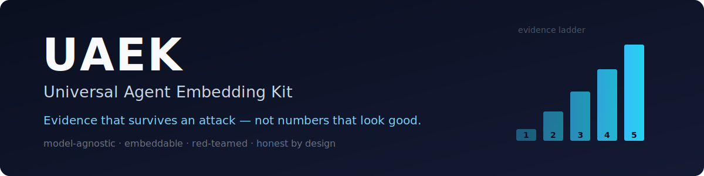

<div align="center">



<br/>

**A model-agnostic, embeddable kit that gives any agent platform stronger verification, context management, effort routing, memory, and workflow — with a benchmark suite built on one rule: report numbers that survive an attack, not numbers that look good.**

<br/>

[](https://github.com/Audrey-cn/universal-agent-embedding-kit/actions/workflows/ci.yml)
[](LICENSE)
[](pyproject.toml)
[](CHANGELOG.md)
[](#status)
[](https://github.com/astral-sh/ruff)
[](CONTRIBUTING.md)

[Quickstart](#-quickstart) · [Evidence](#-honest-evidence) · [Methodology](#-the-methodology-is-the-product) · [Roadmap](#-roadmap) · [Contributing](CONTRIBUTING.md) · [中文](README.zh.md)

</div>

---

## Why UAEK

UAEK started as a study of what made a now-retired frontier agent ("Fable 5") effective, on the thesis that **the advantage was engineering, not the model**. It packages that engineering — verification, adaptive context, effort routing, memory, workflow — as a layer you can embed into *any* agent runtime, and it measures every claim honestly, including where the honest answer is "less impressive than we hoped."

What makes it different isn't a number — it's the **discipline**: every headline metric is red-teamed and reported at its rung on an evidence-strength ladder, with the caveat stated in the open.

## 🚀 Quickstart

> Requires **Python 3.11+**. Install from source (not yet on PyPI).

**One-liner (clone + venv + install + gates):**

```bash
git clone https://github.com/Audrey-cn/universal-agent-embedding-kit.git
cd universal-agent-embedding-kit
bash scripts/setup.sh          # creates .venv, installs, runs ruff + mypy + tests
```

**Or manually:**

```bash
git clone https://github.com/Audrey-cn/universal-agent-embedding-kit.git
cd universal-agent-embedding-kit
python3 -m venv .venv && source .venv/bin/activate
pip install -e '.[dev]'
```

**Try it:**

```bash
uaek --help
uaek benchmark --suite adversarial   # self-grading cheating-rate evidence
uaek capability matrix               # cross-platform graded task matrix
uaek audit --output -                # full audit report as JSON on stdout
python -m pytest -q                  # 396 tests
```

## 🧩 What's inside

| Component | Module | What it does |
|-----------|--------|--------------|
| 🛡️ Universal verification | `src/verify`, `src/adversarial_verification.py` | execution-grounded, **adversarial** (not self-graded) checks |
| 🧠 Adaptive context manager | `src/context_management.py` | relevance filtering + compression vs context rot |
| 🎚️ Effort dispatch | `src/effort` | classify a task → right-size the effort |
| 💰 Cost model | `src/cost_model.py` | cache-aware cost accounting (prompt/KV cache) |
| 🎯 Real-scenario benchmark | `src/scenario_benchmark.py` | multi-dimensional scoring (catches regressions a pass/fail misses) |
| 🔌 Cross-platform capability | `src/capability_matrix.py` | drive + objectively grade real agent platforms |
| 🔧 Workflow / memory / skills / harness | `src/workflow`, `src/memory`, `src/skills`, `src/harness` | orchestration primitives |

Exposed three ways: **CLI** (`uaek`), **HTTP API** (`api/`), and **MCP server** (`mcp/`).

## 🔬 Honest evidence

Every number below is the result of a deliberate **red-team round** (independent agents trying to prove each metric inflated) followed by **hardening** to a value that survives. Numbers came *down* in that process — that's the point. Each is tagged with its rung on the evidence ladder.

| Dimension | Result | Rung | Honest caveat |
|-----------|--------|:----:|---------------|
| Self-grading cheating rate | naive ~60–71% → **adversarial 0%** (target <10%) | ③ | scoped to this corpus + generator, **not** a proof of impossibility |
| Context utilization | adaptive **0.85** expected acc. @70% util vs naive 0.57 | ③ | live needle test recalled 6/6 @31K tokens — validates retrieval, not the adaptive advantage live |
| Cost reduction | modeled −43% (−49% w/ 1h tier); warm live spot-check **−82%, 92% hit** | ④ partial | warm-only best case; a fully-cold session is modeled **22% more expensive** than baseline |
| Real-scenario benchmark | multi-dimensional; flags a feature-complete-but-**regressing** solution | ③ | 30 scenarios / 28 categories — not yet 100+ live multi-hour sessions |
| Cross-platform matrix | **2/4** providers pass the full graded live suite; partial Mimo/Hermes artifacts retained | ④ partial | full-suite means 10/10 tasks; partial 8/10 or 9/10 evidence is not counted as graded-live success |

<a id="status"></a>**Gates:** 396 tests pass · ruff + mypy clean · audit semantics pass locally. Full breakdown and provenance in [`VERIFICATION_SCORECARD.md`](VERIFICATION_SCORECARD.md).

## 🪜 The methodology is the product

The most reusable thing here isn't a metric — it's the discipline two practices enforce:

- **Evidence-strength ladder** — ① local benchmark → ② stress/adversarial → ③ real data → ④ live measurement → ⑤ external validation. "Improving" a metric means climbing the ladder, **never turning a knob**.
- **Red-team hardening** — before reporting a self-measured number, spawn independent agents to *prove it's inflated*, then harden until it survives.

See [`docs/methodology.md`](docs/methodology.md), the research framing in [`RESEARCH_PROPOSAL.md`](RESEARCH_PROPOSAL.md), and the operating procedure in [`SOP.md`](SOP.md) / [`EXECUTION_MANUAL.md`](EXECUTION_MANUAL.md).

## 🗺️ Roadmap

Climbing the evidence ladder is the roadmap:

- [ ] **Rung ④ → ⑤** — multi-provider / multi-sample live runs; remote-CI evidence beyond a single account
- [ ] **Real-scenario corpus** — grow from 30 deterministic scenarios toward 100+ live, multi-hour sessions
- [ ] **Cost, cold-path** — measure TTL-miss-heavy real sessions, not just warm ones
- [ ] **External baseline** — a reproducible substitute for the retired reference model
- [x] **Red-team hardening pass** — every headline metric attacked and hardened
- [x] **Source release packaging, CI gate, evidence archive** path

## 🤝 Contributing

PRs and issues are welcome — see [`CONTRIBUTING.md`](CONTRIBUTING.md). The one non-negotiable: any metric you add or change must come with its **rung** and an **honest caveat**. Run `bash scripts/setup.sh` (or `ruff check . && mypy src && pytest`) before opening a PR. Security reports: [`SECURITY.md`](SECURITY.md).

## ⚠️ Limitations (read these)

- Benchmarks are **deterministic local models with live spot-checks**, not a large-scale live evaluation. Where a claim is modeled, it says so.
- Live measurements lean on a single dominant provider; multi-provider scaling and **external (rung-⑤) validation are open work**.
- The original reference model is retired, so there is **no direct baseline**; comparisons use documented figures and proxy validation, never a fabricated rerun.

## 📄 License

[MIT](LICENSE) · [Changelog](CHANGELOG.md) · [中文版](README.zh.md)
